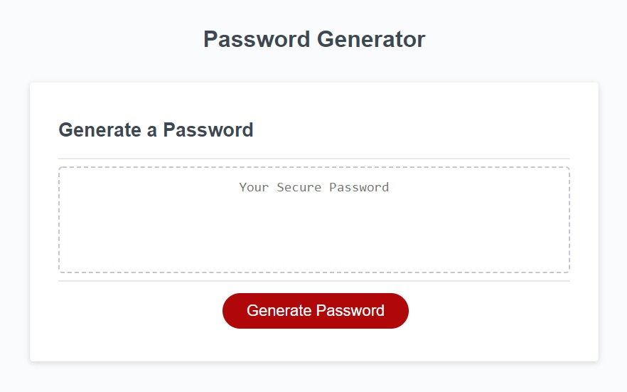
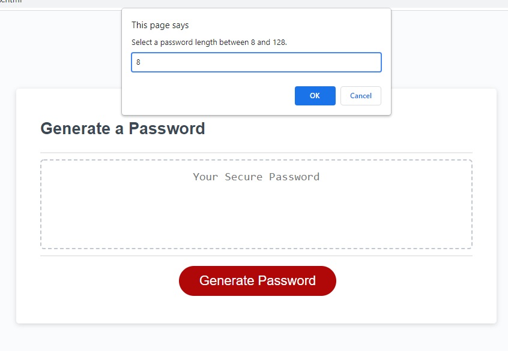
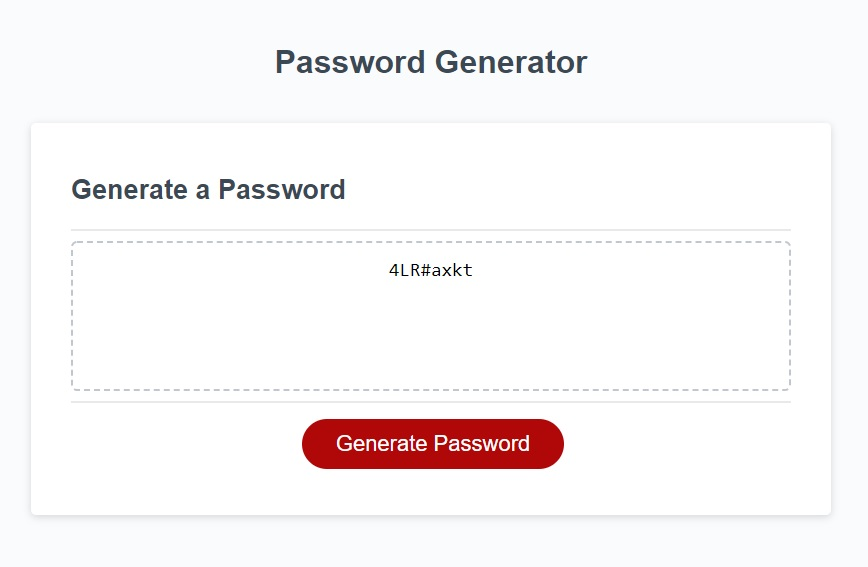

# Password Generator
Code that was already given.

## Motivation
To create a password generator with certain criteria inputs from user.


## Code Style
- HTML
- CSS
- JavaScript

## Screenshots




## Features
- Prompting for user for password lenght:
```
function passwordLengthIsValid(passwordLength) {  
  if (passwordLength < 8) {
    return false;
  }

  if (passwordLength > 128) {
    return false;
  }

  return true;
}
```
- Prompting for user style of password:
```
 if (passwordLengthIsValid(passwordLength)) {    
    var includeLowercase = confirm("Click OK if you want to include lowercase in your password.");
    var includeUppercase = confirm("Click OK if you want to include uppercase in your password.");
    var includeNumeric = confirm("Click OK if you want to include numbers in your password.");
    var includeSpecialChar = confirm("Click OK if you want to include special characters in your password.");    
  } else {
    alert("Invalid number, please try again.");
  } 

  if (includeLowercase || includeUppercase || includeNumeric || includeSpecialChar) {
    returnPassword = generatePasswordFromUserInput(passwordLength, includeLowercase, includeUppercase, includeNumeric, includeSpecialChar);    
  } else {
    alert("You need to at least pick one character type, please try again.");
  }

  return returnPassword;
}
```
- Generating password from given user input:
```
function getRandomValidCharacter(includeLowercase, includeUppercase, includeNumeric, includeSpecialChar) {
  var lowerCaseSet = "abcdefghijklmnopqrstuvwxyz";
  var upperCaseSet = "ABCDEFGHIJKLMNOPQRSTUVXYZ";
  var numericSet = "0123456789";
  var specialCharSet = "!\"#$%&'()*+,-./:;<=>?@[\\]^_`{|}~";

  var passwordPossibleCharacterString = "";

  if (includeLowercase) {
    passwordPossibleCharacterString = passwordPossibleCharacterString + lowerCaseSet;
  }
  if (includeUppercase) {
    passwordPossibleCharacterString = passwordPossibleCharacterString + upperCaseSet;
  }
  if (includeNumeric) {
    passwordPossibleCharacterString = passwordPossibleCharacterString + numericSet;
  }
  if (includeSpecialChar) {
    passwordPossibleCharacterString = passwordPossibleCharacterString + specialCharSet;
  }

  var passwordArray = passwordPossibleCharacterString.split('');
  var i = Math.floor(Math.random() * passwordArray.length);    

  return passwordArray[i];
}
```